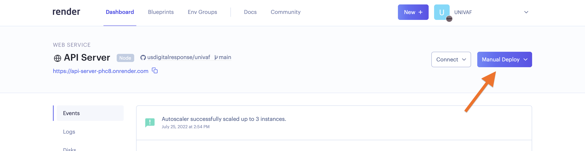
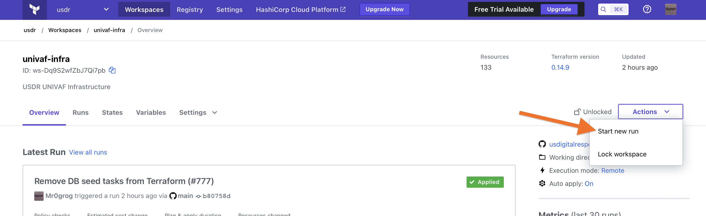

# Runbook: Deployment & Operations Guide

Documents in this folder are a general guide to manipulating and maintaining the [getmyvax.org](https://getmyvax.org) deployment of this software. Since this project is open-source, some things are described in general terms, and you may need to look elsewhere or ask other project members on Slack for details like server addresses, resource names, credentials, etc.

- [General Overview](#general-overview)
    - [AWS](#aws)
    - [Other Services](#other-services)
- [Deployment](#deployment)
    - [Building](#building)
    - [Deploying New Images](#deploying-new-images-to-aws)
- [Bastion Server](#bastion-server)

## General Overview

### Render

Most of the infrastructure and services that support this project run in [Render][] (with a few items in AWS; see below). Render monitors this GitHub repository for changes and will build and re-deploy the various services as needed. We run most things in AWS, but Render provides higher-level tooling that is much easier to manage and fits our needs pretty well.

The configuration for all our Render services is managed in [`render.yaml`](../../render.yaml) in the root of this repo. You can find documentation for what you can do in that file at https://render.com/docs/infrastructure-as-code.

What services run in Render?

- A Postgres database for storing all our data.

- The API Server (code in the `server` directory) is a publicly accessible web service. This is what you’re contacting when you browse to https://getmyvax.org.

- A cron job to snapshot the database and export logs for historical analysis once a day.

- A cron job for each data source we pull information from. These run the loader (code in the `loader` directory) with appropriate arguments for the given source.

- A DataDog agent for sending metrics (see [“Other Services”](#other-services) below).

### AWS

We use AWS for a few things that Render can’t do right now. Like Render, we manage all our AWS resources in code via *Terraform Cloud*, and the configuration files live in the [`terraform`](../../terraform) directory. Any time files in the `terraform` directory change on the `main` branch, Terraform Cloud will automatically apply the current configuration files.

What resources are in AWS?

- DNS for `getmyvax.org` and subdomains.
- A publicly accessible S3 bucket that stores historical data and logs for analysis. (The “snapshot” cron job in Render writes to this bucket nightly.)

*NOTE: we used to run all our services in AWS, so you’ll find more complex Terraform files in this repo’s history. You might also find some legacy resources in AWS that are still being cleaned up.*

### Other Services

We also rely on a handful of other services for critical operations tasks:

- **[Terraform Cloud][terraform-cloud]** manages checking and applying our Terraform configurations.
- **GitHub actions** runs tests and deploys the demo UI (see “GitHub pages” below).
- **[Sentry][sentry]** tracks exceptions in our code. It also tracks warnings about unexpected content in the data we pull in from external sources (e.g. a new, unknown vaccine code), which is critical to keeping the service up-to-date and accurate.
- **[DataDog][]** for general stats on our services. The most imporant of these is usually metrics on HTTP requests. Sometimes the server may be rejecting bad requests with a 4xx status code, and the dashboards in DataDog are the best place to see that happening since they might not trigger exceptions or other kinds of alerts.
- **[1Password][1pw]** stores Important team and partner credentials in a shared *vault*.
- **GitHub pages** hosts the demo UI at https://usdigitalresponse.github.io/univaf/. However, we don’t generally point everyday residents to this URL and are not aware of anybody using it in a production capacity — it’s intended a demonstration and testing tool for API consumers.
- **[Slack][slack-usdr]** for team communication. We have two channels in USDR’s Slack:
    - One for team discussion
    - One for errors and alerts from the above services. When there’s an incident, the alerts channel is usually how we find out about it. We typically start a thread based on the alert that was posted to the channel, so if you are looking for live discussion of an ongoing problem, check there first.

Please get in touch with a project lead for access to any of these systems.

## Deployment

### Build & Deploy

**Most of our production code builds and runs automatically on Render.** Every time a new commit lands on the `main` branch, Render will attempt to build and deploy it. If you need to trigger a deploy manually, log into the [Render dashboard][], click on the service you want to deploy, and click the “manual deploy” button.

**Resources in AWS deploy automatically via Terraform Cloud.** Every time a new commit that changes Terraform files lands on the `main` branch, Terraform Cloud will deploy. It will also *plan* a deployment (and tell you what it would create/update/destroy) every time you push to a Pull Request branch (this will show up as a “check” at the bottom of a PR).

If you need to trigger Terraform manually, log into [Terraform Cloud][terraform-cloud], browse to the “univaf-infra” workspace, click the “actions” dropdown in the upper-right, and select “start new run.”

**The Demo UI is a static site built with Webpack.** We use GitHub Actions to automatically build and publish the site. The [`ui-deploy` workflow][workflow-ui-deploy] automatically builds and deploys the site every time a commit lands on the `main` branch. See the main README for details on [building the static site manually](../../README.md#building-and-viewing-the-ui).

### Terraforming Locally

In order to run terraform locally, you have to auth `terraform` to terraform cloud. This requires a cloud invite; reach out to the project owners to get an invite. Once you clone the repository locally, navigate to the `terraform/` directory in your preferred shell. Run `terraform login`, which will create an API access token for you. You'll be prompted to paste it in to your shell in order to access it. Initialize to the backend using `terraform init`. At this point, you will be able to run terraform commands as expected: `terraform plan`, `terraform apply`, `terraform state list`, etc.

**Please avoid running commands that change Terraform’s state locally (e.g. `terraform apply`) and instead run them in Terraform Cloud.** If you absolutely need to modify state locally, coordinate with the rest of the team by following the instructions below.

### Terraforming changes that require manual state intervention

Terraform plans and applies changes based on a saved *state* that should reflect the actual resources that exist in AWS. Modifying state by applying Terraform changes locally instead of on Terraform Cloud will cause Terraform Cloud to start working based on stale data, and potentially create plans that don’t actually work, which means new changes cannot be deployed!

Follow this process when making any changes in terraform that may affect another person's work.

1. Provide advance notice that this work would affect live TF/infra state outside just the code, and therefore bleed into any other things going on in parallel.
2. Break out the parts that can be done advance of the above stuff and that can follow the normal path for doing things in code.
3. Plan for when to do the work, giving an explicit time window for the changes so others on the team can be aware and avoid doing things that collide with it.
4. Inform team members so they know you’ll be needing immediate review on some PRs.
5. Give clear notification when you are starting and ending that work, so the rest of the team can act appropriately.

[terraform-cloud]: https://app.terraform.io/
[sentry]: https://sentry.io/
[datadog]: https://www.datadoghq.com/
[1pw]: https://1password.com/
[render]: https://render.com/
[render-dashboard]: https://dashboard.render.com/
[slack-usdr]: https://usdigitalresponse.slack.com/
[bastion-server]: https://en.wikipedia.org/wiki/Bastion_host
[terraform-aws-provider]: https://registry.terraform.io/providers/hashicorp/aws/latest/docs
[workflow-ci]: ../../.github/workflows/ci.yml
[workflow-ci-runs]: https://github.com/usdigitalresponse/univaf/actions/workflows/ci.yml
[workflow-ui-deploy]: ../../.github/workflows/ui-deploy.yml
