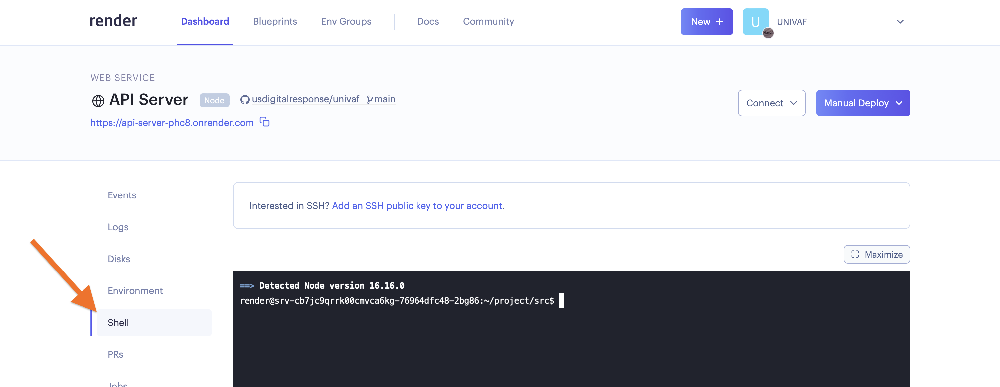

# PostgreSQL Management

- [Overview](#overview)
- [Backups](#backups)
- [Logging in with `psql`](#logging-in-with-psql)
- [Understanding Table Sizes](#understanding-table-sizes)
- [Repacking a Table](#repacking-a-table)


## Overview

The application is currently backed by a single PostgreSQL database server managed through Render. You can view metrics or logs and get a login URL for `psql` in Render’s web dashboard (https://dashboard.render.com/).


## Backups

Render is configured to save daily snapshots of the database, which you can browse in the web dashboard. For details on backups and restoring, see the Render docs: https://render.com/docs/databases#backups.


## Logging in with `psql`

When troubleshooting issues, you might need to log directly into the database and run commands with `psql`. The database doesn’t accept connections from the public web, so you’ll have to log from a shell in Render’s data center instead of directly from your own computer. There are a couple ways to do this:

1. You can start a shell session in your browser by opening Render’s web dashboard, clicking on a service or cron job, and clicking on “shell” in the sidebar.

    

2. Alternatively, you can SSH into a Render service by following the directions at https://render.com/docs/ssh.

Please take special care when logging directly into the production database; you’re working with live data!


## Copying the Database

**First: do you really need to make a raw copy of the database for you situation?** If you just need a frozen copy of some of the data the database has, you should download a snapshot of one (or all) the tables at http://univaf-data-snapshots.s3.amazonaws.com/.

If you really need raw SQL data, then the most straightforward way to do this is with `pg_dump`:

1. Log into a server inside Render’s datacenter first, [as described above](#logging-in-with-psql). For this situation, you may want to create a whole new temporary service with an attached disk to log into, since the database dump may be large.

2. Once you are logged into a shell with access to the database, dump a copy with `pg_dump`. In most cases, you’ll want to skip the `availability_log` table, since it is extremely large. If you need to keep it, try to do your copying work immediately after the “Daily Data Snapshot” job runs so you have the least excess data to worry about.

    To dump a copy without `availability_log` data:

    ```sh
    # Dump schema + data for everything except availability_log
    # (The log has too much data, and is not really important to copy most of time.)
    pg_dump -d "${DATABASE_CONNECTION_STRING}" \
        --no-owner \
        --exclude-table availability_log \
        > /data/univaf_dump.sql

    # Add *schema* for availability_log
    pg_dump -d "${DATABASE_CONNECTION_STRING}" \
        --no-owner \
        --schema-only \
        --table availability_log \
        >> /data/univaf_dump.sql
    ```

    To dump a complete copy, including `availability_log`:

    ```sh
    pg_dump -d "${DATABASE_CONNECTION_STRING}" \
        --no-owner \
        > /data/univaf_dump.sql
    ```


## Restoring a Database Dump

If you’ve made a copy of the database with `pg_dump`, you can restore it into an empty database with `psql`:

1. Log into a server inside Render’s datacenter first, [as described above](#logging-in-with-psql).

2. Put that data in the new database! From your shell session:

    ```sh
    psql -d "${NEW_DATABASE_CONNECTION_STRING}" < /path/to/your/dump.sql
    ```

3. Log into the new database with `psql` and make sure the tables are populated.


## Understanding Table Sizes

Render doesn’t provide great tools for taking a detailed look at the database, and if you are running low on disk space or need to understand what’s taking up resources, you may need to log in with `psql` and run some queries.

The following query can be pretty helpful in understanding basic size information about tables:

```sql
SELECT
  relname as table_name,
  pg_size_pretty(pg_total_relation_size(relid)) As "Total Size",
  pg_size_pretty(pg_relation_size(relid)) as "Content Size",
  pg_size_pretty(pg_indexes_size(relid)) as "Index Size",
  pg_size_pretty(pg_total_relation_size(relid) - pg_relation_size(relid)) as "Non-Content Size",
  pg_stat_get_live_tuples(relid) AS "Live Tuples",
  pg_stat_get_dead_tuples(relid) AS "Dead Tuples"
FROM pg_catalog.pg_statio_user_tables
ORDER BY pg_total_relation_size(relid) DESC;
```

Postgres has a *huge* amount of tooling for reporting on a database. Digging into the docs, Stack Overflow, or googling will turn up a lot of other functions or queries that go way beyond the above.


## Repacking a Table

If a table gets too big and you need to save disk space on the database server, you may need to repack the table after deleting some rows (See [#208][issue-208] for an incident where we needed to do this). When rows are deleted in Postgres, the database does not release the corresponding disk space. Instead, it reserves it for later re-use when it needs to write new rows. If you need to reclaim disk space, you’ll need to perform one of the following operations:

- `TRUNCATE <table>` or `DROP TABLE <table>`. Usually either one of these is not what you want, since they involve deleting all data in the table.

- `VACUUM FULL <table>` removes all dead rows and extra space from the table. It requires as much free disk space as the existing data takes up. **It locks the table for as long as the operation takes,** so make sure a maintenance window of some sort is planned before running this.

- `CLUSTER <table>` re-orders the existing rows on disk so that they match the order of a given index. As a consequence, it removes all dead rows and extra space from the table. It requires as much free disk space as the existing data takes up. **It locks the table for as long as the operation takes,** so make sure a maintenance window of some sort is planned before running this.

- `pg_repack` is an extension that can remove dead rows and extra space while the table is live and available for writes, but it requires the table to have some column that can serve as a unique key (i.e. something that is effectively a primary key, although it does not have to be set as an actual primary key in the table definition). It requires the same extra space that `CLUSTER` and `VACUUM FULL` do, and runs a little bit slower. This article offers a good overview of how to get started with `pg_repack`: https://medium.com/dunzo/reclaiming-storage-space-in-postgres-d32fa4168e67


## Resizing the Database

**Upgrading:** If you need more disk space, memory, or processing power, you can upgrade the databases plan by editing `render.yaml`. Once a change to that file lands on the `main` branch, the database will be upgraded.

**Downgrading:** You can’t currently downgrade to a lower plan for databases in Render right now, so if you want to shrink the database, you’ll have to create a new one and copy the data over from the previous database.

1. Consider planning a maintenance timeframe to do this work. Things could go wrong and you might incur some downtime! The next two steps can be done ahead of time, but everything after will involve making significant changes and potentially pausing some services.

2. Create the new database in Render’s web console (NOT in `render.yaml` — the web console is the only place you can set up DataDog integration). Choose the plan you want and add DataDog credentials so we can get metrics on it.

3. Add the new database to `render.yaml` (don’t remove the old one yet!). If the `name` and other fields in the YAML file match up with what you created manually, Render should automatically link the entry in the YAML file to the new database.

    - When merging these updates into the `main` branch, check the `Blueprints` and `Dashboard` tabs in Render’s web console to make sure it hasn’t created a third database.
    - If you run into problems, you may have to *disconnect* the blueprint and set it up again from scratch (disconnecting won’t remove or alter any services, so that is a messy, but reasonably safe operation).
        1. In the Blueprints tab on Render’s web console, click on the UNIVAF Services blueprint.
        2. Click on the settings entry in the sidebar.
        3. Click “Disconnect Blueprint.”
        4. In the Blueprints tab again, click the “New Blueprint Instance” button.
        5. Select the UNIVAF repo.
        6. It should ask you to verify that it’s linking up the right existing services to the entries in the blueprint (`render.yaml`) file. Make sure everything is good, and tell it to go!

4. Once the above steps are done, wait until a low usage time, or your planned maintenance window to do the rest of the work. Suspend all the loaders (so they stop writing new data; anything new after the next step will be lost until you are done). *Consider* suspending the API Server, although that’s not necessarily required.

5. Follow the directions under [“Copying the Database”](#copying-the-database) to use `pg_dump` to make a copy of the existing database. You’ll probably want to follow the approach that skips the `availability_log` table.

7. Put that data in the new database! Follow the directions under [“Restoring a Database Dump”](#restoring-a-database-dump).

8. Update all the services in the `render.yaml` file that pull their DB connection values from the old database, and change them to use the new database. Merge the changes to `main` and let the services re-deploy.

9. Turn the API Server back on and make sure it’s able to connect to the database and query data.

10. Turn all the loaders back on.

11. Remove the old database entry from `render.yaml`. Note this won’t actually suspend or remove the database. It just stops it from being managed by the file.

12. In Render’s web console, suspend or remove the old database as appropriate.


[issue-208]: https://github.com/usdigitalresponse/univaf/issues/208
